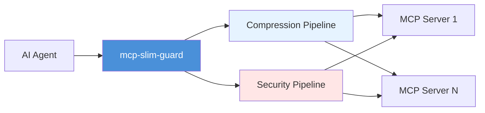
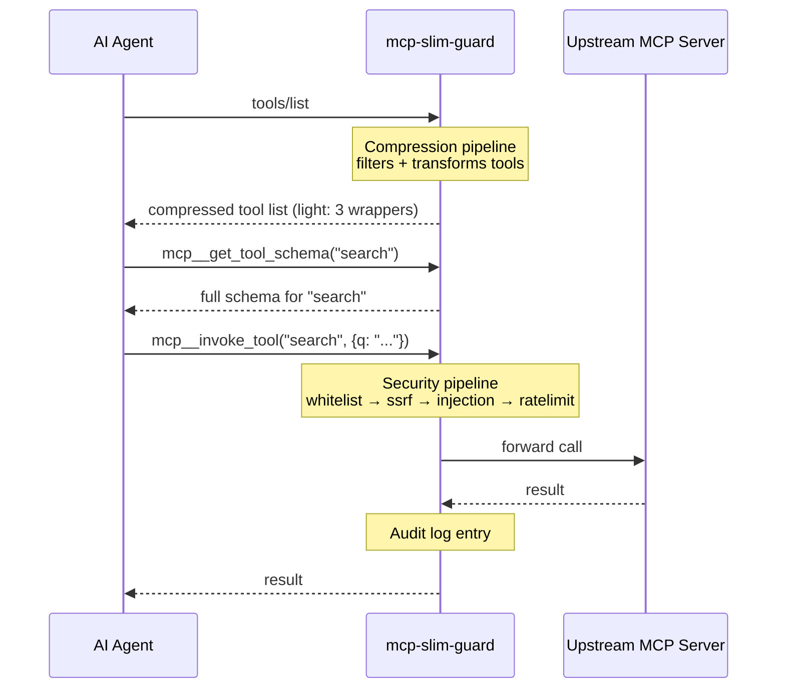

<p align="center">
  <a href="./README_CN.md">中文文档</a> · <strong>English</strong>
</p>

<h1 align="center">🛡️ mcp-slim-guard</h1>

<p align="center">
  <b>One proxy. Two superpowers: compression + security.</b>
</p>

<p align="center">
  <a href="https://www.npmjs.com/package/mcp-slim-guard"></a>
  =18">
  
  
  
  
</p>

<br>

mcp-slim-guard sits between your AI agent and MCP servers, transparently adding **schema compression** (5 levels, up to 86% token reduction) and **security policies** (SSRF protection, tool allow/deny, injection detection, rate limiting, audit logging).



---

## Why mcp-slim-guard?

| Problem               | Impact                                         | How mcp-slim-guard solves it                      |
| --------------------- | ---------------------------------------------- | ------------------------------------------------- |
| **Context wasted**    | Tool schemas eat 60-86% of your context window | 5 compression levels, lazy loading, request cache |
| **No access control** | Any agent calls any tool with any args         | Glob-based allow/deny, fail-closed by default     |
| **SSRF**              | Tool params inject internal network requests   | IP blacklist + domain whitelist                   |
| **Prompt injection**  | Malicious params execute shell/SQL             | 17 heuristic patterns, 3 sensitivity levels       |
| **Abuse**             | Unthrottled tool calls flood upstream          | Token bucket rate limiter (per-tool configurable) |
| **No audit trail**    | No record of who called what                   | Structured JSON audit log with rotation + gzip    |

**Only mcp-slim-guard combines compression AND security in a single proxy.**  
Other tools compress schemas but don't protect you. Security proxies don't save you tokens.

---

## Quick Start

```bash
# Install
npm install -g mcp-slim-guard

# Auto-discover MCP servers from your .mcp.json
cd your-project/
mcp-slim-guard init

# Dry-run policies to check for false positives
mcp-slim-guard validate

# Start the proxy
mcp-slim-guard start
```

Your agent now connects to mcp-slim-guard instead of the original servers. That's it.

> MCP servers are auto-discovered from `.mcp.json`, `mcp.json`, or `claude_desktop_config.json`.

### Generated `mcp-slim-guard.yml`

```yaml
tools:
  allow: ["search_*", "read_*"] # only allow search/read tools
  deny: ["*_delete_*", "*_admin_*"] # block dangerous ops
ssrf:
  mode: block
  block_private_ips: true
  allow_domains: ["*.github.com"]
rate_limit:
  default: 60/min # per-tool rate limit
injection_detection:
  enabled: true
  mode: block
  sensitivity: medium
compressor:
  enabled: true
  level: light # 5 levels: off/light/normal/extreme/maximum
cache:
  enabled: false # TTL+LRU read-only response cache
audit:
  output: file # structured JSON audit log
  maxSize: 10MB
  maxFiles: 5
```

---

## Features

### 🗜️ Schema Compression — Reclaim Your Context Window

| Level       | Strategy                                   | Tokens (14 tools) | Savings  | When to use                                 |
| ----------- | ------------------------------------------ | ----------------- | -------- | ------------------------------------------- |
| `off`       | Passthrough                                | 1,736             | —        | < 5 tools, or testing                       |
| **`light`** | **3 wrapper tools (on-demand schema)**     | **300**           | **-83%** | **⭐ Default. Best balance for most users** |
| `normal`    | 2 wrapper tools (no list_tools)            | 245               | -86%     | 30+ tools, strong LLMs                      |
| `extreme`   | In-place: strip property descriptions      | 1,361             | -22%     | Few tools with complex schemas (10+ params) |
| `maximum`   | In-place: signature only, empty properties | 1,294             | -25%     | Very large individual schemas               |
| `lazy`      | Budget preload + on-demand schema          | 1,644             | -5%      | 30+ tools, most used only occasionally      |

> **Why the big gap?** `light`/`normal` replace all tools with 2-3 wrapper tools (`mcp__invoke_tool`, `mcp__get_tool_schema`). The LLM fetches schemas on demand. `extreme`/`maximum` keep all tools and only compress each schema in place — savings depend on schema complexity.

#### Real-world cost impact

| Setup               | Tokens/call | Monthly cost (DeepSeek V4) |
| ------------------- | ----------- | -------------------------- |
| Without compression | 1,736       | ~$52 (10K calls)           |
| **With `light`**    | **300**     | **~$9 (-83%)**             |

#### Accuracy verified

Benchmarked against DeepSeek V4 Flash across 12 scenarios × 5 levels × 3 runs = 180 API calls.  
[Run it yourself →](#benchmarks)

### 🛡️ Security Pipeline — Defense in Depth

Every tool call runs through a serial pipeline. First rejection stops execution:

```
Agent Request
     │
     ▼
┌─────────────────┐
│  1. Allow/Deny  │  ← Glob pattern matching. Fail-closed.
│  (Whitelist)    │
└────────┬────────┘
         ▼
┌─────────────────┐
│  2. SSRF Shield │  ← IP blacklist + domain whitelist.
│                  │     Blocks 10.*, 192.168.*, 169.254.*
└────────┬────────┘
         ▼
┌─────────────────┐
│  3. Injection   │  ← 17 heuristic patterns:
│     Detection   │     Shell/SQL/NoSQL/Prompt injection
└────────┬────────┘
         ▼
┌─────────────────┐
│  4. Rate Limit  │  ← Token bucket. Per-tool or global.
│                  │     Default: 60 req/min/tool
└────────┬────────┘
         ▼
┌─────────────────┐
│  5. Audit Log   │  ← Structured JSON. Rotate + compress.
│                  │     Every decision recorded.
└────────┬────────┘
         ▼
   Upstream MCP Server
```

### 🔄 Additional Capabilities

| Feature                  | Description                                                                                                  |
| ------------------------ | ------------------------------------------------------------------------------------------------------------ |
| **Multi-server routing** | One proxy, multiple upstream MCP servers. Tool names are prefixed (`{server}_{tool}`) for automatic routing. |
| **Hot reload**           | `kill -HUP <pid>` — zero-downtime config reload. All fields hot-swappable.                                   |
| **Request cache**        | TTL+LRU in-memory cache for read-only tool results. Per-tool stats.                                          |
| **Streamable HTTP**      | `mcp-slim-guard start --http --port 3000` — works as a remote MCP endpoint.                                  |
| **STDIO mode**           | Default. Transparent drop-in for local agents.                                                               |

---

## How It Works



### CLI Reference

| Command                                   | Description                                              |
| ----------------------------------------- | -------------------------------------------------------- |
| `mcp-slim-guard init`                     | Auto-discover `.mcp.json`, generate `mcp-slim-guard.yml` |
| `mcp-slim-guard validate`                 | Dry-run policies, show allow/deny for each tool          |
| `mcp-slim-guard start`                    | Start proxy (STDIO mode)                                 |
| `mcp-slim-guard start --http --port 3000` | Start proxy (HTTP mode)                                  |
| `mcp-slim-guard status`                   | Show config summary + policy overview                    |
| `mcp-slim-guard doctor`                   | Diagnose upstream server connectivity                    |
| `mcp-slim-guard audit`                    | View audit log                                           |
| `mcp-slim-guard uninit`                   | Remove mcp-slim-guard.yml and roll back                  |

---

## Benchmarks

All benchmarks use real MCP server tool schemas (`filesystem` server, 14 tools) with `tiktoken` (gpt-4o encoding).  
Run them yourself: `npm run bench`

### Token Savings

| Level      | Tokens  | Reduction |
| ---------- | ------- | --------- |
| off        | 1,736   | baseline  |
| **light**  | **300** | **-83%**  |
| **normal** | **245** | **-86%**  |
| extreme    | 1,361   | -22%      |
| maximum    | 1,294   | -25%      |
| lazy       | 1,644   | -5%       |

### Latency Overhead

```
Policy pipeline:      ~2ms/call  (whitelist → ssrf → injection → ratelimit)
Compression (light):  <0.05ms
Cache hit:            0.01ms
```

### Accuracy (DeepSeek V4 Flash)

12 scenarios × 5 levels × 3 runs = 180 API calls. Scenarios include 4 fuzzy-name tests (read vs search, list vs tree).

| Level  | Accuracy       | Notes                              |
| ------ | -------------- | ---------------------------------- |
| off    | 100%           | Baseline                           |
| light  | ✅ (on-demand) | Wrapper mode uses extra round-trip |
| normal | ✅ (on-demand) | Same as light                      |

---

## Comparison

| Feature                    | mcp-slim-guard       | slim-mcp            | mcp-compressor      | mcp-guardian     |
| -------------------------- | -------------------- | ------------------- | ------------------- | ---------------- |
| Schema compression         | ✅ 5 levels, -86%    | ✅ 5 levels, -77%   | ✅                  | ❌               |
| Accuracy validation        | ✅ 180 API calls     | ✅ 120 API calls    | ❌                  | —                |
| Request cache              | ✅ TTL+LRU           | ❌                  | ❌                  | ❌               |
| Tool allow/deny            | ✅ Glob-based        | ❌                  | ❌                  | ✅               |
| SSRF protection            | ✅ IP + domain       | ❌                  | ❌                  | ✅               |
| Injection detection        | ✅ 17 patterns       | ❌                  | ❌                  | ✅               |
| Rate limiting              | ✅ Token bucket      | ❌                  | ❌                  | ✅               |
| Audit log                  | ✅ JSON, rotation    | ❌                  | ❌                  | ✅               |
| Hot reload                 | ✅ SIGHUP            | ❌                  | ❌                  | ❌               |
| Multi-server routing       | ✅ Prefix auto-route | ❌                  | ❌                  | ❌               |
| HTTP transport             | ✅ Streamable HTTP   | ❌                  | ✅                  | ❌               |
| **Compression + Security** | **✅ One proxy**     | ❌ Compression only | ❌ Compression only | ❌ Security only |

---

## Requirements

- **Node.js** >= 18
- **Only 5 production dependencies** (MCP SDK, commander, js-yaml, micromatch, pino)

---

## Docker

```bash
docker build -t mcp-slim-guard .
docker run -i --rm -v $(pwd)/mcp-slim-guard.yml:/app/mcp-slim-guard.yml mcp-slim-guard start
```

---

## License

MIT
