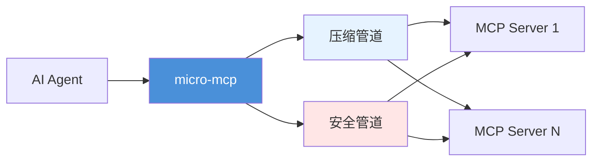
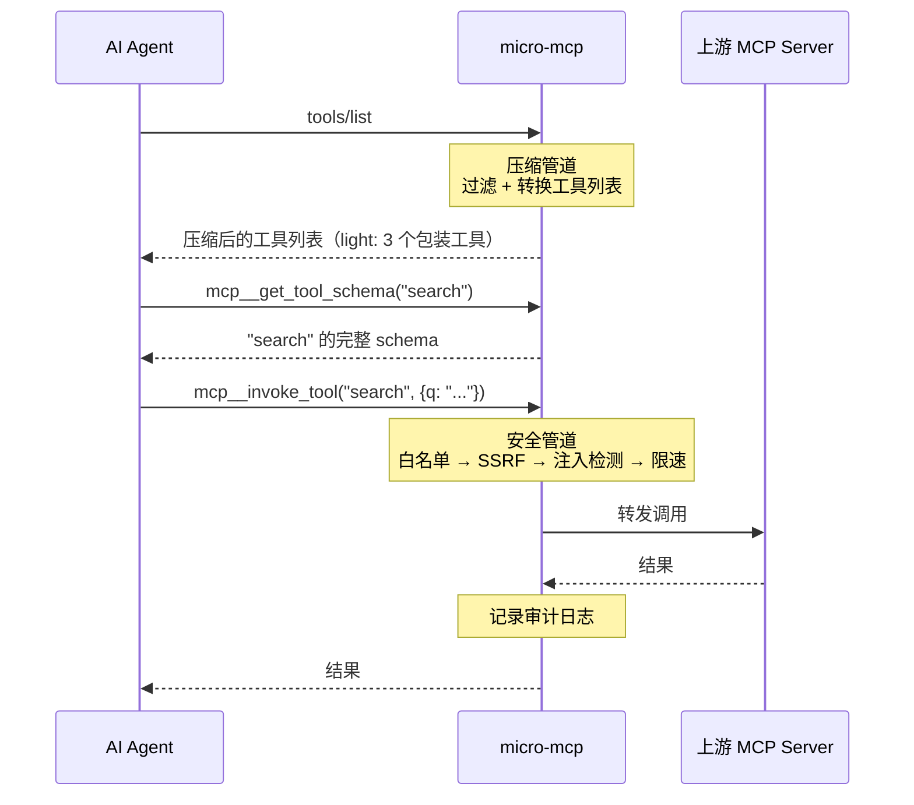

<p align="center">
  <strong>中文文档</strong> · <a href="./README.md">English</a>
</p>

<h1 align="center">🛡️ micro-mcp</h1>

<p align="center">
  <b>一个代理，两大超能力：压缩 + 安全。</b>
</p>

<p align="center">
  <a href="https://www.npmjs.com/package/micro-mcp"></a>
  =18">
  
  
  
  
</p>

<br>

micro-mcp 是放在 AI Agent 和 MCP Server 之间的轻量代理，透明地加上 **Schema 压缩**（5 级，最高减少 86% Token）和**安全策略管道**（SSRF 防护、工具白名单、注入检测、限速、审计日志）。



**同类唯一：一个代理同时搞定压缩 + 安全。**  
其他工具要么只压缩不管安全，要么只安全不省 Token。

---

## 为什么需要 micro-mcp？

| 问题            | 影响                                 | micro-mcp 方案                  |
| --------------- | ------------------------------------ | ------------------------------- |
| **上下文浪费**  | 工具 Schema 吃掉 60-86% 的上下文窗口 | 5 级压缩 + 按需加载 + 缓存      |
| **无访问控制**  | 任何 Agent 可调用任意工具            | Glob 白名单/黑名单，默认拒绝    |
| **SSRF**        | 参数注入内网请求                     | IP 黑名单 + 域名白名单          |
| **Prompt 注入** | 恶意参数执行 Shell/SQL               | 17 种启发式检测，3 级灵敏度     |
| **滥用**        | 工具调用洪泛上游                     | Token Bucket 限速（逐工具可配） |
| **无审计**      | 不知道谁调了什么                     | 结构化 JSON 日志，轮转 + 压缩   |

---

## 快速开始

```bash
# 安装
npm install -g micro-mcp

# 自动发现 .mcp.json 中的 MCP Server
cd your-project/
micro-mcp init

# 干跑策略，检查是否误杀
micro-mcp validate

# 启动代理
micro-mcp start
```

> 自动发现 `.mcp.json`、`mcp.json`、`claude_desktop_config.json`。

### 生成的 `micro-mcp.yml`

```yaml
tools:
  allow: ["search_*", "read_*"] # 只允许 search/read 前缀
  deny: ["*_delete_*", "*_admin_*"] # 禁止危险操作
ssrf:
  mode: block
  block_private_ips: true
  allow_domains: ["*.github.com"]
rate_limit:
  default: 60/min # 每工具每分钟 60 次
injection_detection:
  enabled: true
  mode: block
  sensitivity: medium
compressor:
  enabled: true
  level: light # 5 级: off/light/normal/extreme/maximum
cache:
  enabled: false # TTL+LRU 只读结果缓存
audit:
  output: file # 结构化 JSON 审计日志
  maxSize: 10MB
  maxFiles: 5
```

---

## 功能

### 🗜️ Schema 压缩 — 拿回你的上下文窗口

| 等级        | 策略                                | Tokens (14 工具) | 节省     | 推荐场景                               |
| ----------- | ----------------------------------- | ---------------- | -------- | -------------------------------------- |
| `off`       | 透传                                | 1,736            | —        | < 5 个工具，或测试                     |
| **`light`** | **3 个包装工具（按需获取 schema）** | **300**          | **-83%** | **⭐ 默认推荐，绝大多数场景最佳平衡**  |
| `normal`    | 2 个包装工具（无 list_tools）       | 245              | -86%     | 30+ 工具，强 LLM                       |
| `extreme`   | 原地压缩：去掉参数描述              | 1,361            | -22%     | 少量工具但单个 schema 复杂（10+ 参数） |
| `maximum`   | 签名模式，清空 properties           | 1,294            | -25%     | 单个工具 schema 极大                   |
| `lazy`      | 预算预加载 + 按需获取               | 1,644            | -5%      | 30+ 工具，大部分不常用                 |

> **为什么差距这么大？** `light`/`normal` 把所有工具替换成 2-3 个包装工具（`mcp__invoke_tool`、`mcp__get_tool_schema`），LLM 按需获取 schema。`extreme`/`maximum` 保留所有工具，只压缩每个工具的 schema 字段——省多少取决于 schema 本身有多复杂。

#### 实际成本换算

| 配置           | Tokens/次 | 月成本（DeepSeek V4, 1 万次调用） |
| -------------- | --------- | --------------------------------- |
| 不压缩         | 1,736     | ~¥380                             |
| **用 `light`** | **300**   | **~¥65 (-83%)**                   |

#### 准确率已验证

基于 DeepSeek V4 Flash，12 场景 × 5 等级 × 3 轮 = 180 次 API 调用。  
[自行运行 →](#基准测试)

### 🛡️ 安全管道 — 纵深防御

每次工具调用都串行经过以下管道，任一环节拒绝即停止：

```
Agent 请求
     │
     ▼
┌─────────────────┐
│  1. 白名单/黑名单 │  ← Glob 模式匹配。默认拒绝（fail-closed）
└────────┬────────┘
         ▼
┌─────────────────┐
│  2. SSRF 防护    │  ← IP 黑名单 + 域名白名单
│                  │     自动拦截 10.*, 192.168.*, 169.254.*
└────────┬────────┘
         ▼
┌─────────────────┐
│  3. 注入检测     │  ← 17 种启发式模式
│                  │     Shell/SQL/NoSQL/Prompt 注入
└────────┬────────┘
         ▼
┌─────────────────┐
│  4. 限速         │  ← Token Bucket
│                  │     默认：60 次/分钟/工具
└────────┬────────┘
         ▼
┌─────────────────┐
│  5. 审计日志     │  ← 结构化 JSON
│                  │     轮转 + gzip 压缩
└────────┬────────┘
         ▼
   上游 MCP Server
```

### 🔄 更多能力

| 功能               | 说明                                                            |
| ------------------ | --------------------------------------------------------------- |
| **多 Server 路由** | 一个代理代理多个上游。工具名自动加 `{server}_` 前缀，按前缀路由 |
| **热重载**         | `kill -HUP <pid>` — 零停机重载配置。所有字段都支持热更新        |
| **请求缓存**       | TTL+LRU 内存缓存只读工具结果，逐工具统计命中率                  |
| **HTTP 模式**      | `micro-mcp start --http --port 3000` — 作为远程 MCP 端点        |
| **STDIO 模式**     | 默认模式，即插即用                                              |

---

## 工作原理



### 命令参考

| 命令                                 | 说明                                    |
| ------------------------------------ | --------------------------------------- |
| `micro-mcp init`                     | 自动发现 MCP 配置，生成 `micro-mcp.yml` |
| `micro-mcp validate`                 | 干跑策略，显示每个工具的 allow/deny     |
| `micro-mcp start`                    | 启动代理（STDIO 模式）                  |
| `micro-mcp start --http --port 3000` | 启动代理（HTTP 模式）                   |
| `micro-mcp status`                   | 查看配置摘要 + 策略概览                 |
| `micro-mcp doctor`                   | 诊断上游 MCP Server 连通性              |
| `micro-mcp audit`                    | 查看审计日志                            |
| `micro-mcp uninit`                   | 删除 micro-mcp.yml 回滚                 |

---

## 基准测试

所有基准使用真实 MCP Server 工具 schema（`filesystem` 服务，14 工具），`tiktoken` gpt-4o 编码。  
自行运行：`npm run bench`

### Token 节省

| 等级       | Tokens  | 节省     |
| ---------- | ------- | -------- |
| off        | 1,736   | 基线     |
| **light**  | **300** | **-83%** |
| **normal** | **245** | **-86%** |
| extreme    | 1,361   | -22%     |
| maximum    | 1,294   | -25%     |
| lazy       | 1,644   | -5%      |

### 延迟开销

```
策略管道:       ~2ms/次  (白名单 → SSRF → 注入检测 → 限速)
压缩 (light):  <0.05ms
缓存命中:       0.01ms
```

### 准确率 (DeepSeek V4 Flash)

12 场景 × 5 等级 × 3 轮 = 180 次 API 调用。含 4 个模糊工具名测试。

| 等级   | 准确率    | 说明                            |
| ------ | --------- | ------------------------------- |
| off    | 100%      | 基线                            |
| light  | ✅ (按需) | wrapper 模式需多一轮获取 schema |
| normal | ✅ (按需) | 同上                            |

---

## 竞品对比

| 特性            | micro-mcp          | slim-mcp         | mcp-compressor | mcp-guardian |
| --------------- | ------------------ | ---------------- | -------------- | ------------ |
| Schema 压缩     | ✅ 5 级，-86%      | ✅ 5 级，-77%    | ✅             | ❌           |
| 准确率验证      | ✅ 180 API calls   | ✅ 120 API calls | ❌             | —            |
| 请求缓存        | ✅ TTL+LRU         | ❌               | ❌             | ❌           |
| 工具白名单      | ✅ Glob 模式       | ❌               | ❌             | ✅           |
| SSRF 防护       | ✅ IP + 域名       | ❌               | ❌             | ✅           |
| 注入检测        | ✅ 17 种模式       | ❌               | ❌             | ✅           |
| 限速            | ✅ Token Bucket    | ❌               | ❌             | ✅           |
| 审计日志        | ✅ JSON，轮转      | ❌               | ❌             | ✅           |
| 热重载          | ✅ SIGHUP          | ❌               | ❌             | ❌           |
| 多 Server 路由  | ✅ 前缀自动分发    | ❌               | ❌             | ❌           |
| HTTP 传输       | ✅ Streamable HTTP | ❌               | ✅             | ❌           |
| **压缩 + 安全** | **✅ 一个代理**    | ❌ 仅压缩        | ❌ 仅压缩      | ❌ 仅安全    |

---

## 环境要求

- **Node.js** >= 18
- **仅 5 个生产依赖**（MCP SDK, commander, js-yaml, micromatch, pino）

---

## Docker

```bash
docker build -t micro-mcp .
docker run -i --rm -v $(pwd)/micro-mcp.yml:/app/micro-mcp.yml micro-mcp start
```

---

## License

MIT
