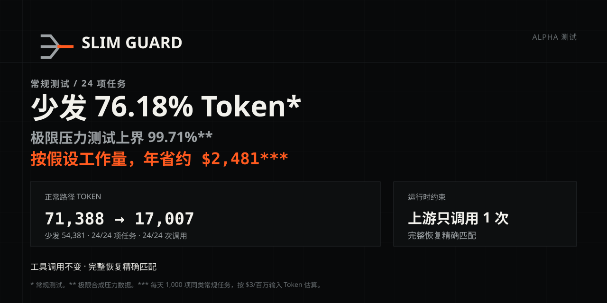
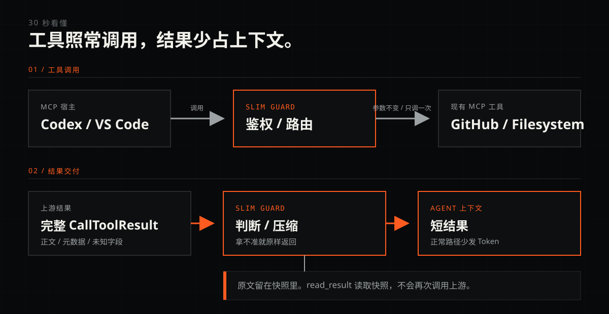

<p align="center">
  
</p>

<p align="center"><strong>MCP 工具链里的 Headroom</strong></p>

<p align="center">
  常规测试少发 76.18% Token · 极限压力测试上界 99.71% · 可逆恢复
</p>

Slim Guard 在 MCP 上下文进入 Agent 前压缩工具目录和大结果。工具调用不变，
只发更少 Token。

_常规测试：71,388 → 17,007 正常路径 Token。极限压力测试：
499,556 → 1,437 协议 Token。_

<p align="center"><sub>0.1.1 Alpha · 本地 stdio · Node.js 20+</sub></p>

<p align="center">
  <a href="https://github.com/lennney/mcp-slim-guard/actions/workflows/ci.yml"></a>
  <a href="https://www.npmjs.com/package/mcp-slim-guard"></a>
  <a href="https://github.com/lennney/mcp-slim-guard/blob/5141b7c78c7d5a8c21151fcc5d17a1af209b87a0/LICENSE"></a>
  <a href="https://github.com/lennney/mcp-slim-guard/blob/5141b7c78c7d5a8c21151fcc5d17a1af209b87a0/package.json"></a>
</p>

<p align="center">
  <a href="#快速上手">快速上手</a> ·
  <a href="#选择宿主入口">宿主入口</a> ·
  <a href="#验证数据">验证数据</a> ·
  <a href="#兼容性">兼容性</a> ·
  <a href="https://github.com/lennney/mcp-slim-guard/blob/main/README.md">English</a>
</p>

## 先看结果



**常规测试：**24 项任务的正常路径 Token 从 71,388 降到 17,007，比原始 MCP
少 76.18%；24 项任务对应 24 次上游调用。

**压力测试上界：**100 个合成工具、一份 8,000 行结果，正常路径协议 Token
从 499,556 降到 1,437。上游工具只执行一次，完整恢复精确匹配。查看
[压力测试证据](https://github.com/lennney/mcp-slim-guard/blob/main/docs/evidence/2026-07-27-automatic-compression-stress.md)。

|      正常路径 Token | 少发 Token |         年度节省示例* |    任务与上游调用 |
| ------------------: | ---------: | --------------------: | ----------------: |
| 71,388 → **17,007** | **54,381** | **每年节省约 $2,481** | **24/24 · 24/24** |

<sub>*按每天 1,000 项同类 MCP 任务、$3/百万输入 Token 估算：
54,381 ÷ 24 × 1,000 × 365 ÷ 1,000,000 × $3 ≈ $2,481。不是实测 API
账单；测试没有调用模型或 API。</sub>

```bash
npm install -g mcp-slim-guard@alpha
```

一个项目接入多个 MCP Server，宿主会把工具说明和长结果塞进 Agent
上下文。Slim Guard 在它们进入上下文前做一层可逆交付：工具按需发现，长结果先
给短版，需要原文时再用 `read_result` 读取。

Slim Guard 原样转发参数。每次请求最多执行一次上游工具。压缩和恢复在本地
完成，不调用模型。



## 工作方式

| 进入 Slim Guard 的内容  | Agent 收到什么                                                         |
| ----------------------- | ---------------------------------------------------------------------- |
| 工具目录                | 通用入口只留下 `find_tool`、`call_tool` 和 `read_result`               |
| 长文本、统一 JSON、日志 | 更短的结果；需要原文时用 `read_result` 读取快照                        |
| 代码、diff、错误等结果  | 原样返回                                                               |
| 绑定 schema 的结果      | 原样返回，保留 `outputSchema`、`structuredContent`、`_meta` 和未知字段 |

Codex 使用 `--surface native` 时，仍能看到授权后的原始工具名。交付、存储、观察
或审计出错时，Slim Guard 直接返回上游结果。

## 快速上手

Slim Guard 需要 Node.js 20 或更高版本，以及已有的项目级 MCP 配置。

安装 Alpha：

```bash
npm install -g mcp-slim-guard@alpha
```

导入项目中已经配置的 MCP Server：

```bash
cd /absolute/path/to/your-project
mcp-slim-guard init
mcp-slim-guard validate
```

`init` 生成 `mcp-slim-guard.yml`。检查该文件后，将宿主原来的 MCP Server
条目替换为一个 Slim Guard 条目。原始入口和 Slim Guard 不要同时暴露。

`init` 可以导入常见 JSON、Cursor 和 VS Code MCP 配置，但不能导入 Codex
TOML。只有 Codex 配置的项目必须先根据
[手工上游模板](https://github.com/lennney/mcp-slim-guard/blob/main/docs/host-setup.md#codex-cli)
创建 `mcp-slim-guard.yml`，再把 Slim Guard 加入 `.codex/config.toml`。

## 选择宿主入口

Slim Guard 不根据宿主元数据猜测入口。请显式选择。

| 入口    | 宿主可见内容                              | 适用场景                           |
| ------- | ----------------------------------------- | ---------------------------------- |
| Native  | 授权后的原始工具和 `read_result`          | 宿主保留工具发现、身份和逐工具审批 |
| Generic | `find_tool`、`call_tool` 和 `read_result` | 宿主需要通用兼容入口               |

### Codex：原始工具

在项目的 `.codex/config.toml` 中加入：

```toml
[mcp_servers.slim_guard]
command = "mcp-slim-guard"
args = ["start", "--surface", "native"]
cwd = "/absolute/path/to/your-project"
```

检查解析结果：

```bash
codex mcp list
```

Codex CLI 已经通过该入口完成模型选择的原始工具调用和多页精确恢复。

### VS Code：原始工具

在 `.vscode/mcp.json` 中加入：

```json
{
  "servers": {
    "slim-guard": {
      "type": "stdio",
      "command": "mcp-slim-guard",
      "args": ["start", "--surface", "native"],
      "cwd": "${workspaceFolder}"
    }
  }
}
```

当前证据检查了 VS Code 接口和逐工具审批模型，尚未验证 VS Code 模型选择调用。

### 通用 `mcpServers` 宿主

使用默认入口：

```json
{
  "mcpServers": {
    "slim-guard": {
      "command": "mcp-slim-guard",
      "args": ["start"],
      "cwd": "/absolute/path/to/your-project"
    }
  }
}
```

宿主应当只看到：

```text
find_tool
call_tool
read_result
```

命令定位、连接检查和配置边界见
[宿主接入指南](https://github.com/lennney/mcp-slim-guard/blob/main/docs/host-setup.md)。

## 结果如何交付

| MCP 结果                               | 交付方式                              |
| -------------------------------------- | ------------------------------------- |
| 大型纯文本                             | 头尾视图和精确快照                    |
| 统一 JSON 数组                         | 更省 Token 时转成字段只出现一次的表格 |
| 日志类文本                             | 保留错误和边界，标记重复噪声          |
| 小型、代码、diff 或不确定结果          | 原样返回                              |
| 结构化、混合、错误或绑定 schema 的结果 | 原样返回                              |

压缩只在上游 `CallToolResult` 已经产生后开始。原样路径保留 `isError`、内容顺序
和类型、`structuredContent`、`_meta`、`outputSchema` 及未知字段。

紧凑结果包含 `result_ref` 时，使用 `read_result` 分段读取快照。恢复不会执行
上游。

## 查看一次完整调用

本地演示加载 12 个上游工具，发现其中一个，捕获 73,507 字符的结果，并恢复
精确分片。上游计数保持为一。

```text
$ npm run demo:alpha

1. Upstream catalog: 12 tools
2. Agent catalog: 3 tools -> find_tool, call_tool, read_result
3. Discovery: fixture_generate_report -> tool_3b5c122fb5b6a0d...
4. Large result: head-tail-v1, 73507 chars -> capsule
5. On-demand recovery: 24000 exact chars
6. Upstream execution count: 1
PASS: Compress what agents see. Preserve what tools do.
```


## 验证数据


| 冻结的 12 工具、24 任务 fixture | 原始 MCP | `mcp-compressor 0.31.6` | Slim Guard |
| ------------------------------- | -------: | ----------------------: | ---------: |
| 正常路径 Token                  |   71,388 |                  54,710 | **17,007** |
| Agent 可见工具                  |       12 |                       2 |      **3** |
| 完成任务                        |    24/24 |                   24/24 |  **24/24** |
| 上游调用                        |       24 |                      24 |     **24** |

在该 fixture 中，Slim Guard 正常路径比原始 MCP 少 76.18% Token，比
`mcp-compressor` 少 68.91%。23 个超大结果用例全部精确重建。

这是使用 `o200k_base` 测量的确定性协议 fixture，没有调用模型或 API。它不是
通用节省比例。

两个大型报告强制完整恢复后使用 39,899 Token，`mcp-compressor` 路径为
37,975 Token。已公开的 5.07% 额外开销仍是优化目标。

复现：

```bash
npm install
npm run build
npm run bench:compression:verify
```

阅读固定版本的
[基准方法](https://github.com/lennney/mcp-slim-guard/blob/9ecade9/docs/evidence/2026-07-26-alpha-benchmark-bilingual.md)、
[真实 MCP Server smoke](https://github.com/lennney/mcp-slim-guard/blob/9ecade9/docs/evidence/2026-07-26-real-mcp-server-smoke.md)
和
[宿主采用检查点](https://github.com/lennney/mcp-slim-guard/blob/9ecade9/docs/evidence/2026-07-28-host-adoption-checkpoint.md)。

## 为什么叫“MCP 工具链里的 Headroom”

[Headroom](https://docs.headroomlabs.ai/docs/architecture)
让“先压缩、保留原文、需要时再取回”这件事很好理解。Slim Guard
把这个直觉放到 MCP 工具目录和 `CallToolResult`
上，所以中文介绍里称它为“MCP 工具链里的 Headroom”。

这是一句帮助理解产品的类比，不是性能对比，也不代表两个项目存在合作关系。

## 适用场景

以下情况适合使用 Slim Guard：

- 一个宿主加载很多 MCP 工具；
- 上游工具经常返回长报告、JSON 数组或日志；
- Agent 通常只需要紧凑结果，但必须保留精确恢复能力；
- 宿主需要保留原始工具名称和逐工具审批。

Slim Guard 不压缩模型 provider prompt、对话历史、源文件或所有结果形态。它只
处理 MCP 工具目录和工具结果。

## 安全与可观察性

- 未授权工具不会进入发现和调用路径。
- 每次调用绑定当前目录中的一个确定条目。
- 非法工具参数在执行上游前返回 `InvalidParams`。
- API key 必须使用环境变量引用；`init` 拒绝敏感字段中的明文值。
- 审计默认不记录凭证、参数、结果正文和原始 capability 引用。

跟踪一次调用：

```bash
mcp-slim-guard log --file ./mcp-slim-guard-audit.log
```

典型阶段：

```text
policy/success -> upstream/success -> projection/projected
recovery/chunk
```

## 兼容性

| 路径                  | 当前证据                             |
| --------------------- | ------------------------------------ |
| 本地 stdio 入口       | Alpha 主要路径                       |
| stdio 上游            | 支持                                 |
| Streamable HTTP 上游  | 通过共享 adapter 支持                |
| GitHub MCP Server     | 只读多 block 结果通过                |
| Filesystem MCP Server | 大型结构化结果精确恢复               |
| Everything MCP Server | 结构化结果原样通过                   |
| ContextForge          | HTTP bridge 到 Slim Guard stdio 通过 |
| Codex CLI             | 原始工具模型选择和精确恢复通过       |
| VS Code               | 已检查原生接口和审批模型             |
| 下游 Streamable HTTP  | 实验能力，仅限 loopback              |

## 使用边界

- Alpha 以本地 stdio 为主。
- Native 入口已在 Codex 完成端到端验证；VS Code 仍是预览支持。
- 结果引用只属于一个 runtime generation。
- 本次 Alpha 不包含生产级远程入口和多租户控制面。
- 安全检查只报告 finding，不会改写可恢复的原始结果。

## 项目链接

参见
[参与贡献](https://github.com/lennney/mcp-slim-guard/blob/main/CONTRIBUTING.md)、
[架构](https://github.com/lennney/mcp-slim-guard/blob/main/docs/architecture-mcp-slim-guard.md)、
[路线图](https://github.com/lennney/mcp-slim-guard/blob/main/docs/ROADMAP.md)。

## License

MIT
