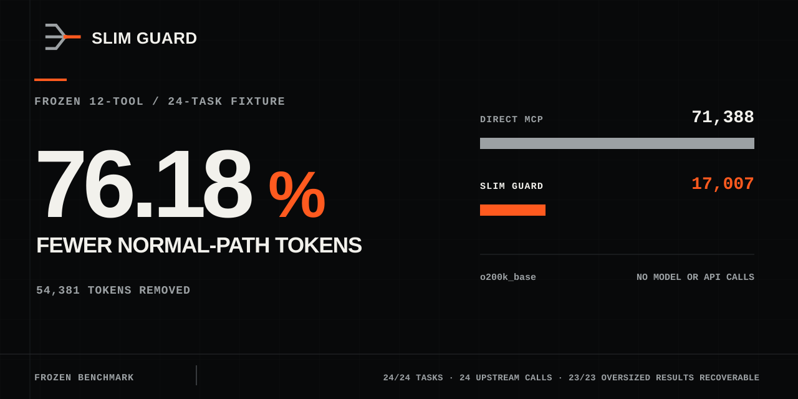

# Alpha Compression Benchmark / Alpha 压缩基准

Date: 2026-07-26  
Status: Frozen deterministic evidence



## English

Slim Guard completed the frozen English and Chinese MCP protocol fixture while
making exactly one upstream call per task.

| Path       | Normal-path tokens | Tasks | Upstream calls |
| ---------- | -----------------: | ----: | -------------: |
| Direct MCP |             71,388 | 24/24 |             24 |
| Slim Guard |             17,007 | 24/24 |             24 |

That is 76.18% fewer normal-path protocol tokens in this fixture. The test is
a local deterministic replay with 12 fixture Tools and 24 tasks. It makes no
model or provider API calls and does not measure model selection accuracy,
provider caching, billing, or a universal savings rate.

All oversized projection cases in the fixture reconstructed to the original
MCP content. The upstream call count stayed equal to the task count.

Reproduce from the repository:

```bash
npm run build
npm run bench:compression:verify
```

## 中文

Slim Guard 完成了这组冻结的中英文 MCP 协议任务，并保持每项任务只调用一次
上游。

| 路径       | 正常路径 Token |  任务 | 上游调用 |
| ---------- | -------------: | ----: | -------: |
| 原始 MCP   |         71,388 | 24/24 |       24 |
| Slim Guard |         17,007 | 24/24 |       24 |

在这组 fixture 中，正常路径协议 Token 减少 76.18%。测试是本地确定性回放，
包含 12 个 fixture 工具和 24 项任务，不调用模型或供应商 API，也不代表模型选
工具准确率、缓存、账单或任意场景都能达到的节省比例。

所有超大投影用例都恢复到了原始 MCP 内容，上游调用次数与任务数保持一致。

复现：

```bash
npm run build
npm run bench:compression:verify
```
